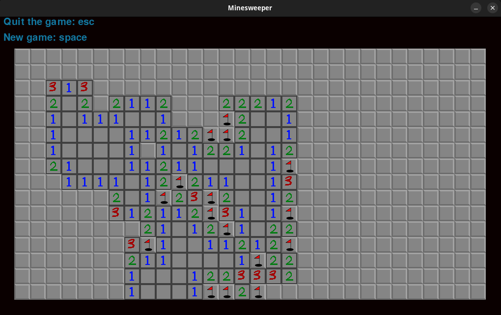

# Minesweeper

The classic game of minesweeper.

<p align="center">
  
</p>

## Usage

After cloning this repository and installation with the command:
```
pip install .
```
the game can be started with the command
```
minesweeper [width] [height] [n_mines]
```
where the arguments are optional.
